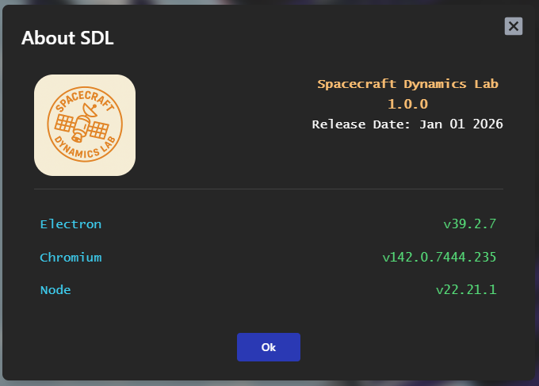
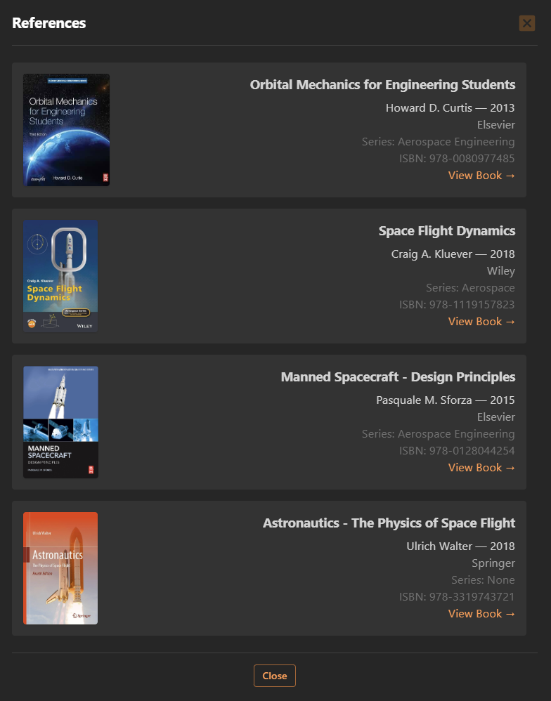
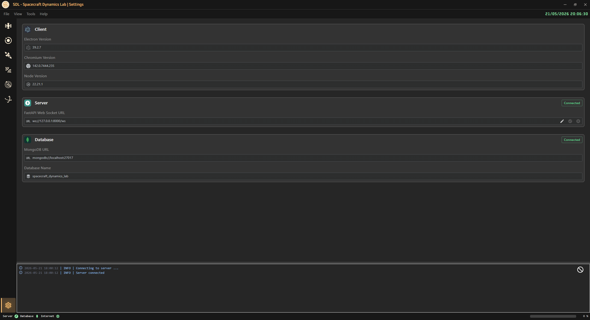
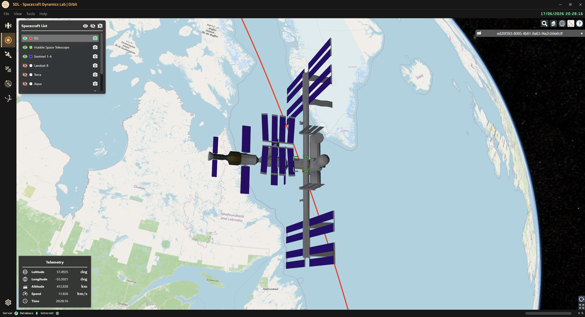
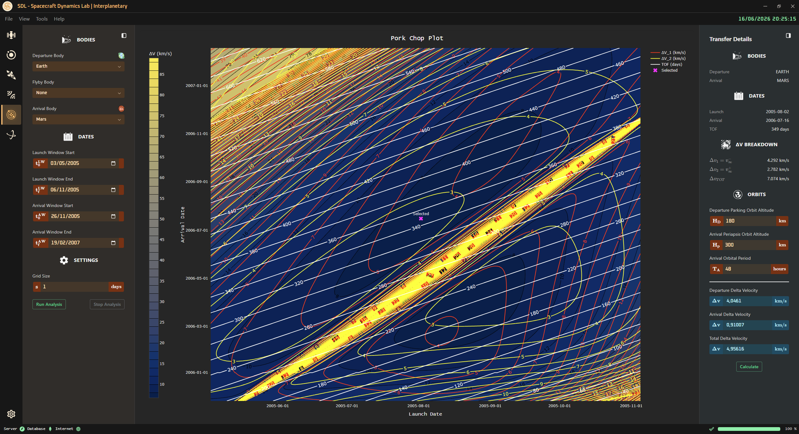

<!-- markdownlint-disable MD033 -->

# 🛰️ Spacecraft Dynamics Lab (S.D.L.)

> ⚠️ **Important Notice**
> This software is intended for educational, research, and simulation purposes only.
> It must not be used for real spacecraft operations, mission planning, navigation,
> or any safety‑critical decision-making.

Spacecraft Dynamics Lab is an Electron desktop application to simulate spacecraft dynamics.

    

## Building **Spacecraft Dynamics Lab**: A Modern App with React, Electron, and Python

Scientific software has a reputation for being powerful but visually outdated. Many tools in orbital mechanics — from GMAT to custom research scripts — rely on legacy UI frameworks, blocking the adoption of modern interaction patterns, responsive layouts, and real‑time visualization.

`Spacecraft Dynamics Lab` (**SDL**) is my attempt to build a modern, engineering‑grade desktop application for orbital mechanics, using a stack that feels more like Linear or Figma than a traditional scientific tool.

I want to explain the architecture, the design decisions, and the lessons learned while building SDL with:

- React for the UI
- Electron for the desktop shell
- TailwindCSS for styling
- Radix UI for accessible primitives
- Python + FastAPI for scientific computation
- Plotly for real‑time visualization

SDL is built on a hybrid architecture:

- Electron
  - Desktop Shell • IPC Bridge
- React (Frontend)
  - UI • Panels • Controls
  - TailwindCSS • Radix UI
- WebSocket
- FastAPI (Backend)
  - Python Astrodynamics API
  - Astropy • NumPy • SciPy
- Simulation Engine

This separation gives me:

- React → modern UI
- Electron → desktop distribution
- Python → scientific correctness
- WebSockets → real‑time streaming
- Plotly → interactive visualization

Spacecraft Dynamics Lab is an experiment:

> Can we build a modern, polished, engineering‑grade scientific tool using web technologies?

## 🔖 References

Here are some references that were used to develop the application:

| **Title** | **Authors** | **Year** | **Publisher** | **URL** |
| --- | --- | --- | --- | --- |
| **Orbital Mechanics for Engineering Students** | Howard D. Curtis | 2013 | Elsevier | [View Book →](https://www.elsevier.com/books/orbital-mechanics-for-engineering-students/curtis/9780080977478) |
| **Space Flight Dynamics** | Craig A. Kluever | 2018 | Wiley | [View Book →](https://www.wiley.com/en-us/Space+Flight+Dynamics-p-9781119157823) |
| **Manned Spacecraft – Design Principles** | Pasquale M. Sforza | 2015 | Elsevier | [View Book →](https://shop.elsevier.com/books/manned-spacecraft-design-principles/sforza/978-0-12-804425-4) |
| **Astronautics - The Physics of Space Flight** | Ulrich Walter | 2018 | Springer | [View Book →](https://link.springer.com/book/10.1007/978-3-319-74373-8) |

    

## 📋 Table Of Contents

> Click on the links below to navigate through the documentation.

➡️ [DEPENDENCIES](docs/github/dependencies.md)

➡️ [SCRIPTS](docs/github/scripts.md)

➡️ [STRUCTURE](docs/github/structure.md)

---

➡️ [MODELS](docs/github/models.md)

➡️ [TOOLS](docs/github/tools.md)

➡️ [SPACECRAFT](docs/github/spacecraft.md)

➡️ [ORBIT](docs/github/orbit.md)

➡️ [ORBITAL MANEUVERS](docs/github/orbital-maneuvers.md)

➡️ [RELATIVE MOTION](docs/github/relative-motion.md)

➡️ [INTERPLANETARY](docs/github/interplanetary.md)

➡️ [ORBITAL PERTURBATIONS](docs/github/orbital-perturbations.md)

➡️ [CIRCULAR RESTRICTED THREE-BODY PROBLEM](docs/github/circular-restricted-three-body-problem.md)

➡️ [SETTINGS](docs/github/settings.md)

## 🖼️ Images

  

  

  

