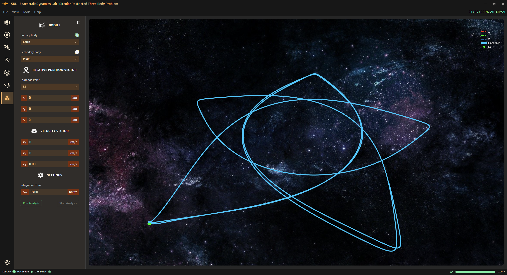

<!-- markdownlint-disable MD033 -->

# 🔺 Circular Restricted Three-Body Problem

⬅️ [HOME](../../README.md)

The **Circular Restricted Three-Body Problem** (CR3BP) is a simplified model of the motion of a small body (like a satellite or an asteroid) under the gravitational influence of two larger bodies (like the Earth and the Moon) that are in circular orbits around their common center of mass. This model is particularly useful for studying the dynamics of spacecraft in the vicinity of the Earth-Moon system or other similar systems in the solar system.

The user can select a pair of primaries from the solar system and the relative position with respect to a chosen Lagrange point.

    

