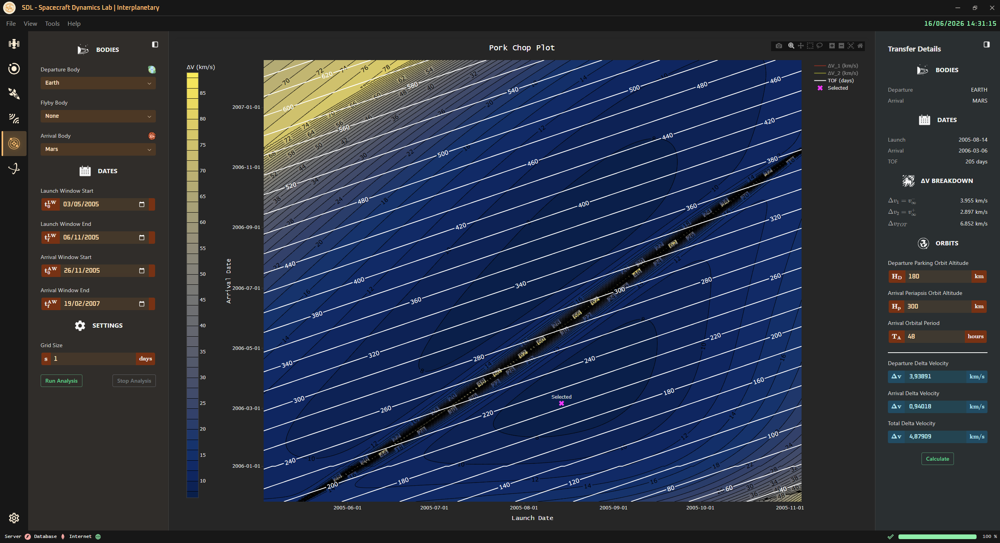
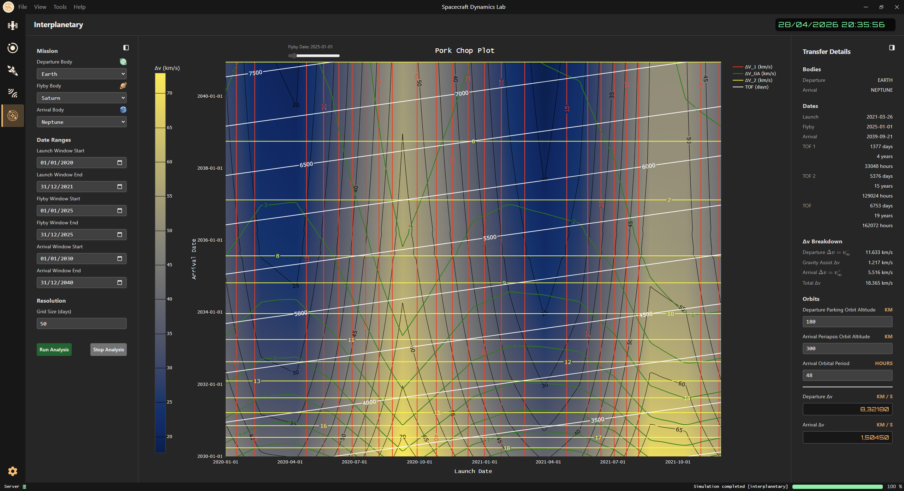

<!-- markdownlint-disable MD033 -->

# 🚀 Interplanetary Page

⬅️ [HOME](../../README.md)

The **Interplanetary Page** allows to study the Pork-Chop of an interplanetary mission between two planets of the solar system. It is also possible to select a third planet on which executing a fly-by (eventually with a Gravity Assist maneuver).

    

    

