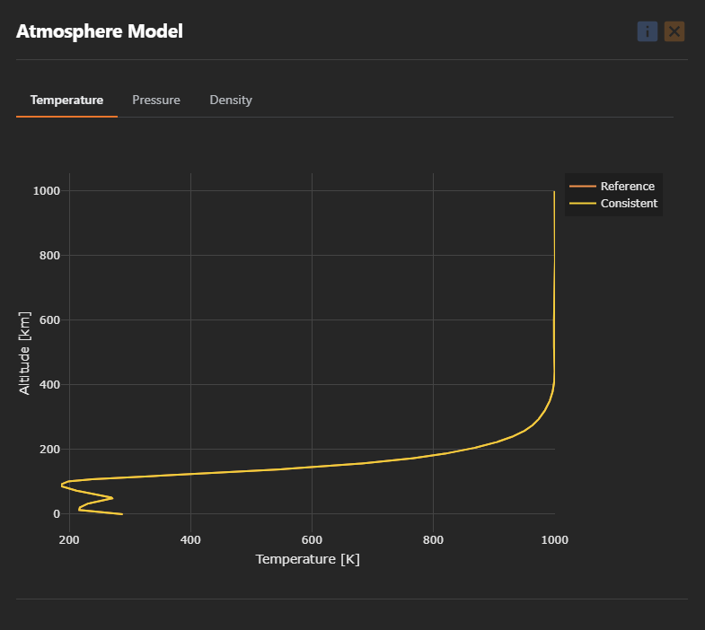

<!-- markdownlint-disable MD033 -->

# 🧩 Models

⬅️ [HOME](../../README.md)

Under the menu option **Tools**, the user can take advantage of a series of instruments.

## 🌍 Atmosphere

The `Atmosphere` dialog shows the trend of Temperature, Pressure, and Density of the Earth atmosphere, using the *U.S. Standard Atmosphere 1976* model.

    

