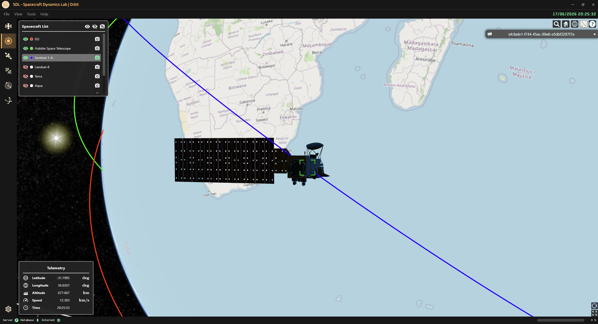

<!-- markdownlint-disable MD033 -->

# 🪐 Orbit Page

⬅️ [HOME](../../README.md)

The **Orbit Page** displays all the created spacecraft orbits. There is a list on the top-left where the user can:

- Hide the orbit by clicking on the item
- Move to current position by clicking on the camera icon
- Show all / Hide all orbits with top icons
- Remove current position tracking with top icon

By clicking on the camera icon (top-right), you will start tracking in real-time the spacecraft moving on its orbit: current data for telemetry will be displayed on the bottom-left panel.

  

