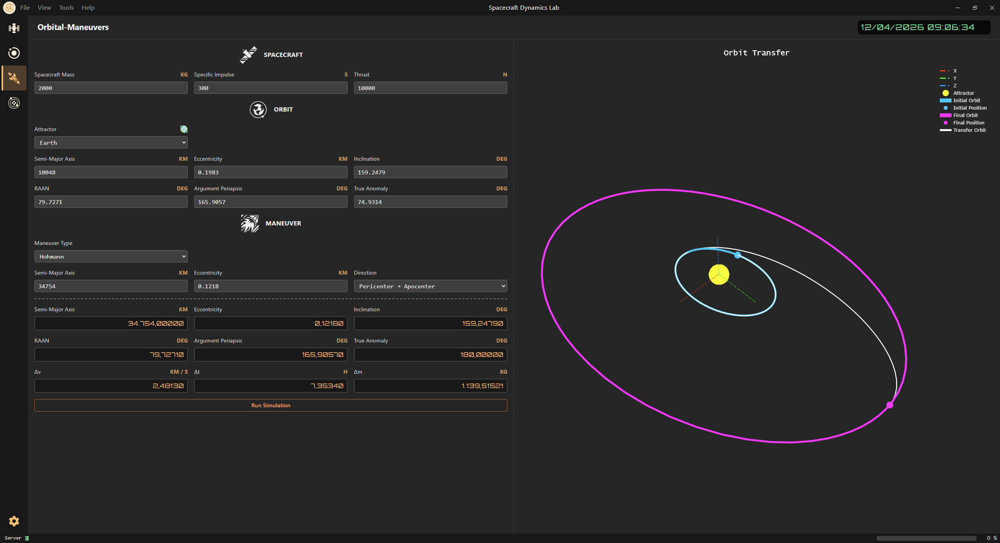

<!-- markdownlint-disable MD033 -->

# 🚀 Orbital Maneuvers Page

⬅️ [HOME](../../README.md)

The **Orbital Maneuvers Page** allows to study different classical orbital maneuvers to move a spacecraft on an orbit with different orbital elements. The following maneuvers have been implemented (with parameters to be set).

| Maneuver Type | Parameters to Set | Description |
| --- | --- | --- |
| **Hohmann** | **Semi‑Major Axis**, **Eccentricity**, **Direction** | Classic two‑impulse transfer between coplanar circular/elliptical orbits |
| **Bi‑Elliptic Hohmann** | **Semi‑Major Axis**, **Eccentricity**, **Support Apocenter** | Three‑impulse transfer using a high apocenter to reduce Δv for large radius changes |
| **Phasing** | **Target True Anomaly**, **Number of Revolutions** | Adjusts orbital period to synchronize position with a target spacecraft |
| **Non‑Hohmann** | **Target Radius**, **Target True Anomaly** | Generalized transfer when Hohmann assumptions don’t apply (e.g., elliptical targets) |
| **Apse Line Rotation** | **Argument of Periapsis**, **Intersection Point** | Rotates the line of apsides (ω) to align pericenter/apocenter with mission geometry |
| **Chase** | **Target True Anomaly**, **Delta Time** | Computes the maneuver needed to intercept or rendezvous with a target after Δt |
| **Plane Change** | **Inclination**, **RAAN** | Rotates the orbital plane by adjusting inclination and ascending node |

 

    

