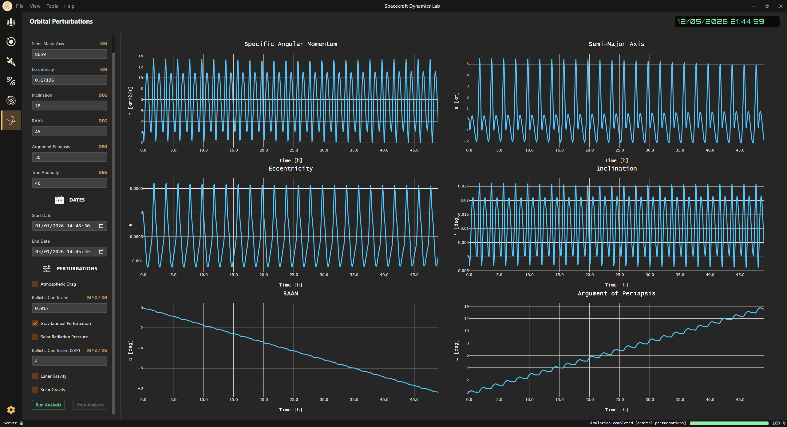

<!-- markdownlint-disable MD033 -->

# 🚀 Orbital Perturbations

⬅️ [HOME](../../README.md)

The **Orbital Perturbations Page** allows to study the effects of various perturbing forces on a spacecraft's orbit.
The user can select:

- Initial orbital elements of the spacecraft
- Start and end time of the simulation
- Perturbing forces to be considered in the simulation
  - Atmospheric Drag (with ballistic coefficient and USSA76 atmospheric density model)
  - Gravity Perturbations (J2)
  - Solar Radiation Pressure (with ballistic coefficient)
  - Third Body Perturbations (lunar gravity and solar gravity)

    

