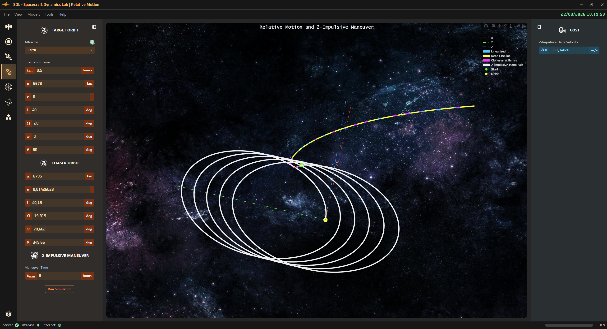

<!-- markdownlint-disable MD033 -->

# 🎯 Relative Motion Page

⬅️ [HOME](../../README.md)

The **Relative Motion Page** allows to study the relative motion of a chaser spacecraft with respect to a target spacecraft.
In addition, a 2-impulsive maneuver can be studied together to the simulated relative motion using:

- linearized equations
- near-circular equations
- Clohessy-Wiltshire equations

 

    

