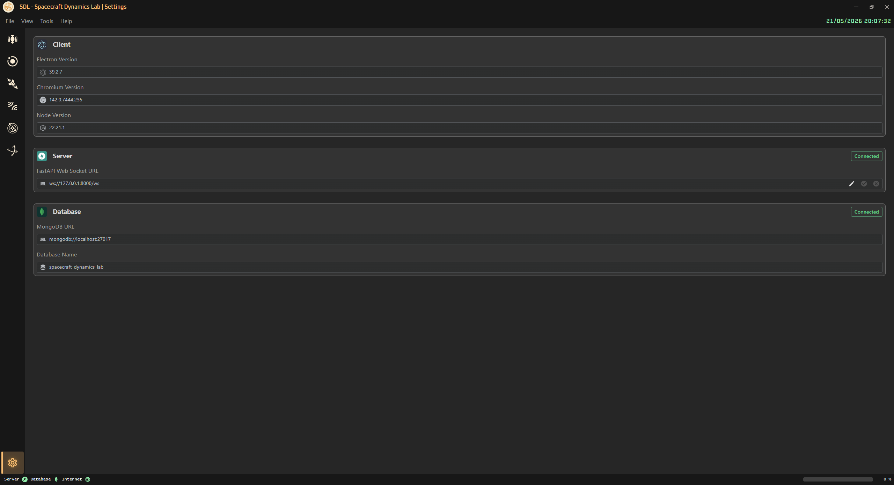

<!-- markdownlint-disable MD033 -->

# ⚙️ Settings

⬅️ [HOME](../../README.md)

The **Settings Page** allows to configure the application.

The user can see the actual versions of the client application.

The web socket server URL can be edited if needed, for example to connect to a custom server or to a remote server.

The database url and name can be visualized but not edited, since they are managed by the backend.

    

