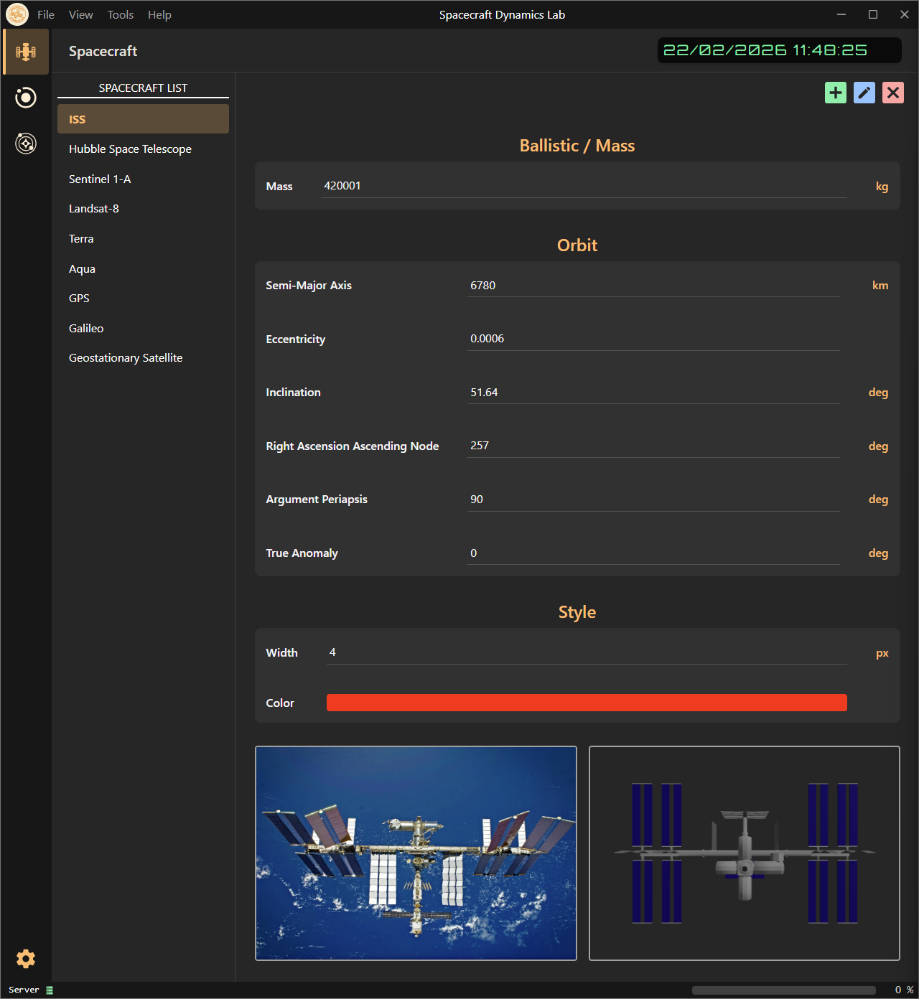
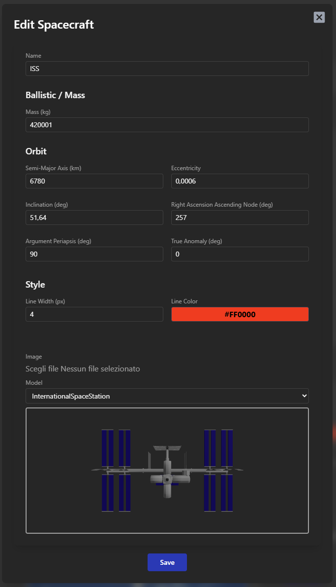

<!-- markdownlint-disable MD033 -->

# 🛰️ Spacecraft Page

⬅️ [HOME](../../README.md)

The **Spacecraft Page** displays all the created spacecraft: selecting a spacecraft in the list, the details are shown on the right. The user can *add*, *edit*, and *delete* a spacecraft.

  

The dialog contains all info of a spacecraft:

- Name (must be unique)
- Ballistic/Mass
  - Mass
- Orbit
  - Semi-major axis
  - Eccentricity
  - Inclination
  - Right Ascension of the Ascending Node
  - Argument of Periapsis
  - True Anomaly
- Style (for the `Orbit` page)
  - Line width
  - Line color
- Image
- Model (.glb)

  

