<!-- markdownlint-disable MD033 -->

# 🛠️ Tools

⬅️ [HOME](../../README.md)

Under the menu option **Tools**, the user can take advantage of a series of instruments.

## ♻️ Orbit Representation

The `Orbit Representation` dialog furnishes different utilities to convert orbital data in different formats and representations.

  

    <h3>Cartesian → Orbit Parameters</h3>
    

      Given a main <strong>attractor</strong> and the <strong>cartesian parameters</strong> (position and velocity) of an orbit, the converter calculates the <strong>orbit parameters</strong> with conic type classification.
    

  

  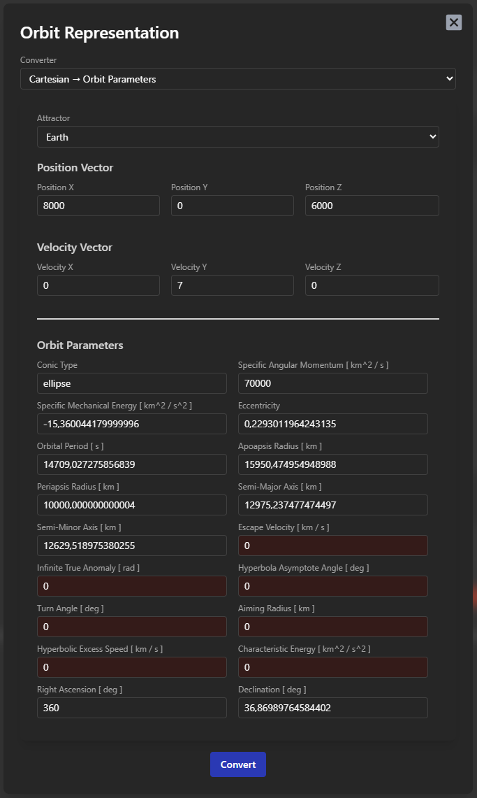

  

    <h3>Cartesian → Keplerian</h3>
    

      Given a main <strong>attractor</strong> and the <strong>cartesian parameters</strong> (position and velocity) of an orbit, the converter calculates the <strong>keplerian parameters</strong> of the orbit.
    

  

  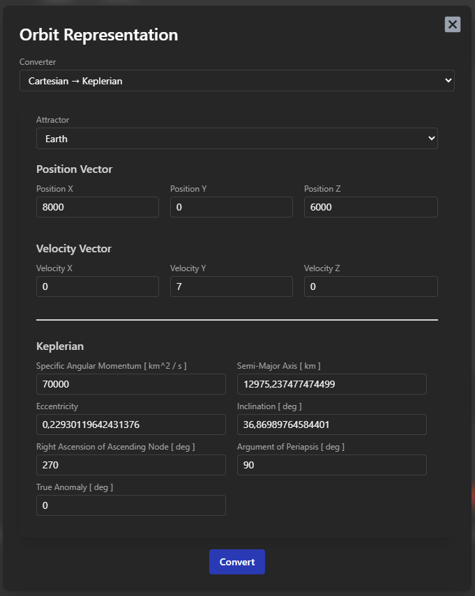

  

    <h3>Cartesian → Perifocal</h3>
    

      Given a main <strong>attractor</strong> and the <strong>cartesian parameters</strong> (position and velocity) of an orbit, the converter calculates the <strong>perifocal parameters</strong> (position and velocity) of the orbit.
    

  

  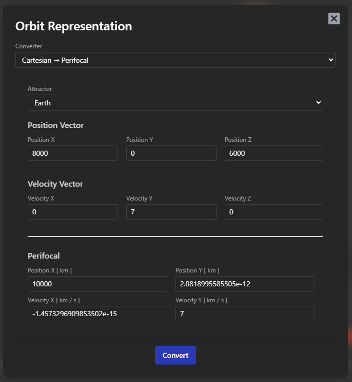

  

    <h3>Keplerian → Cartesian</h3>
    

      Given a main <strong>attractor</strong> and the <strong>keplerian parameters</strong> of an orbit, the converter calculates the <strong>inertial reference frame parameters</strong> (position and velocity) of the orbit.
    

  

  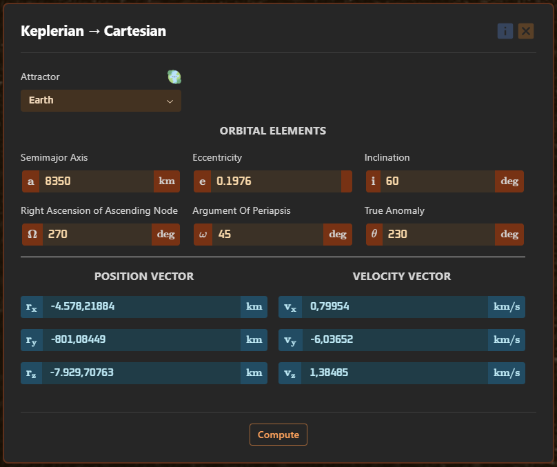

  

    <h3>Ground Track Propagation</h3>
    

      Given a main <strong>attractor</strong> and the <strong>keplerian parameters</strong> of an orbit, the converter calculates the <strong>right ascension</strong> and <strong>declination</strong> of the satellite on the propagated position, with the oblateness effect of the selected planet.
    

  

  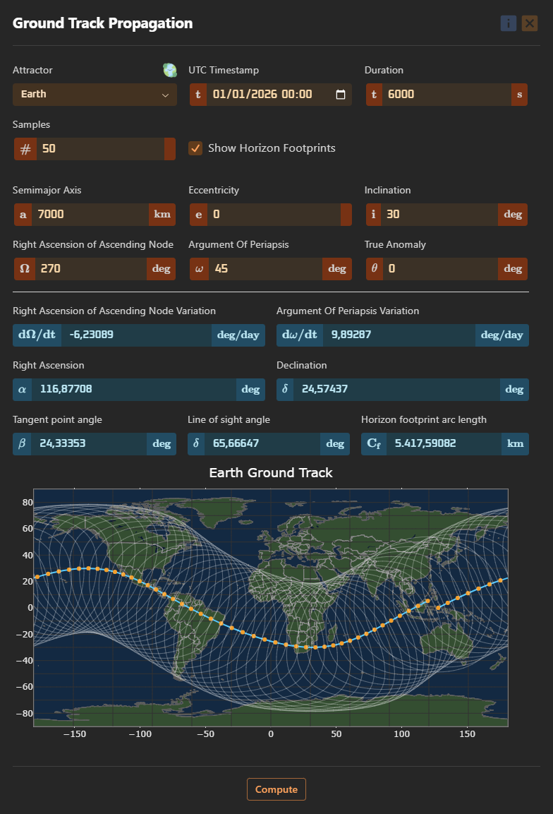

## 🔭 Orbit Determination

The `Orbit Determination` dialogs furnishes different utilities to convert predict an orbit from available data.

  

    <h3>Gibbs Method</h3>
    

      Given 3 position vectors in the <strong>Inertial Reference Frame</strong>, compute the orbital elements.
    

  

  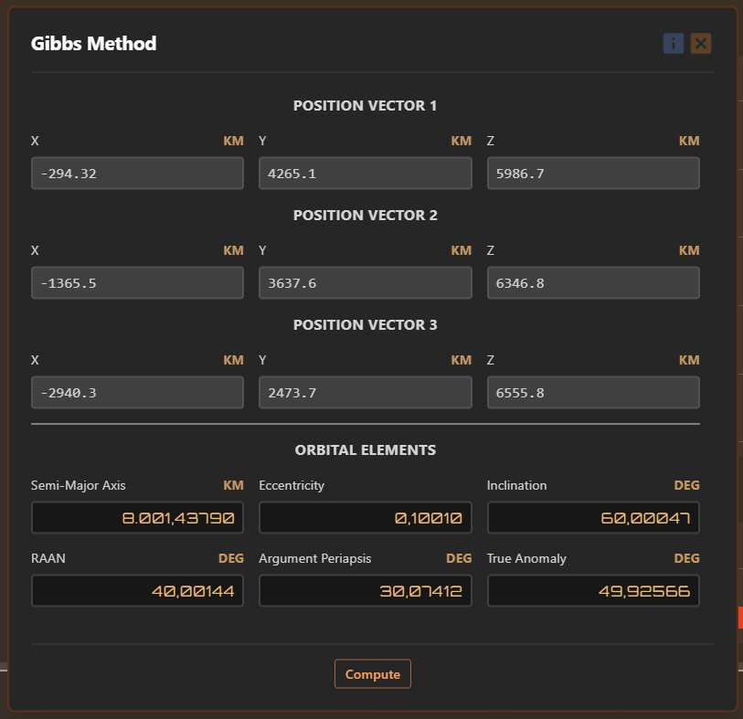

  

    <h3>Julian Day</h3>
    

      Converters between UTC timestamp and <strong>Julian Day</strong>.
    

  

  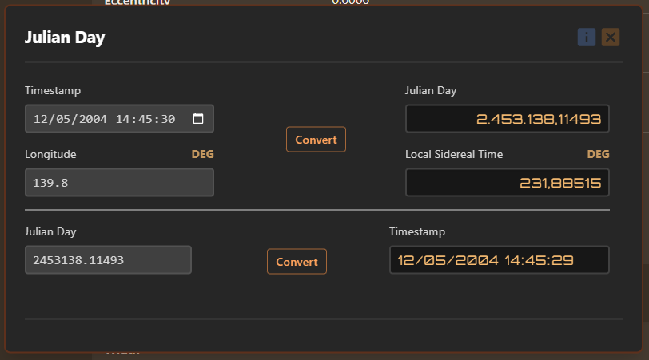

  

    <h3>Topocentric Frame</h3>
    

      Given the Geocentric Equatorial Position vector of an earth-based tracking station (for which the altitude, latitude, and local sidereal times are known), compute the derived position vectors and the orientation in the sky.
    

  

  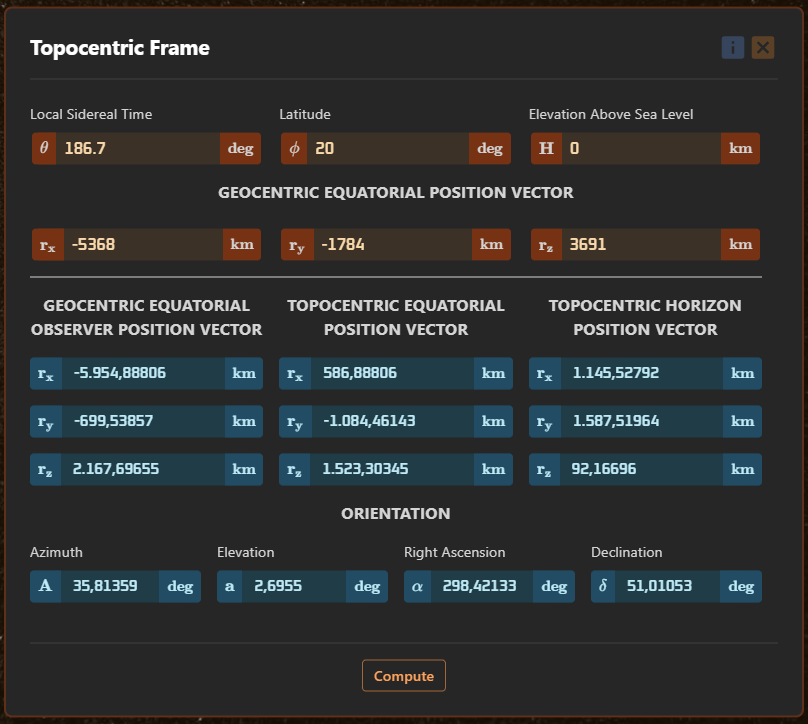

  

    <h3>Angle Range</h3>
    

      Given the range, azimuth, angular elevation together with their rates relative to an earth-based tracking station (for which the altitude, latitude, and local sidereal times are known), calculate the state vectors in the geocentric equatorial frame.
    

  

  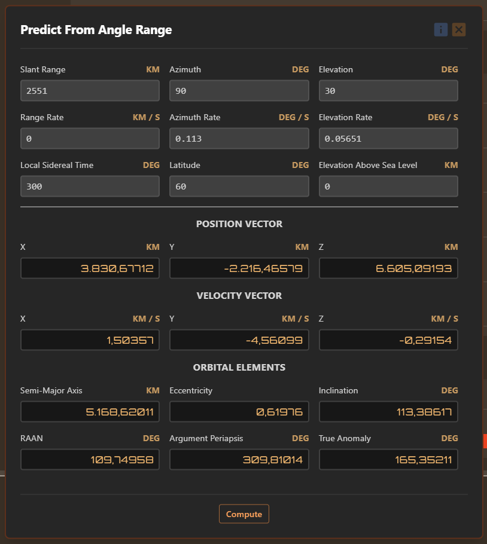

  

    <h3>Gauss Method</h3>
    

      Given the direction cosine vectors and the observer's position vectors at 3 times (for which the altitude and latitude are known), compute the orbital elements.
    

  

  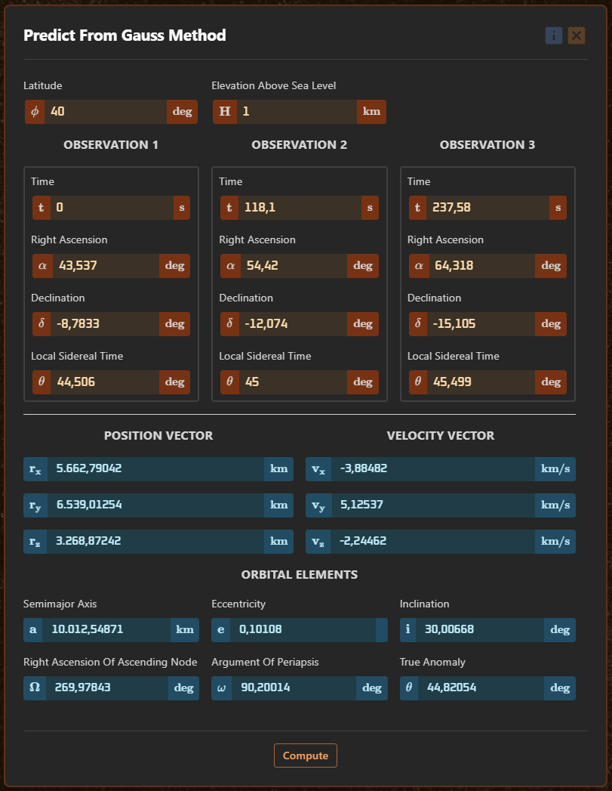

## 🌀 Orbital Perturbations

The `Orbital Perturbations` dialogs furnishes different utilities to analyse the effects of various forces on orbital
motion.

  

    <h3>Nodal Regression</h3>
    

      Analyse the secular effect of the Earth's oblateness (J₂) and third-body perturbations (lunar and solar) on the
      right ascension of the ascending node.
    

  

  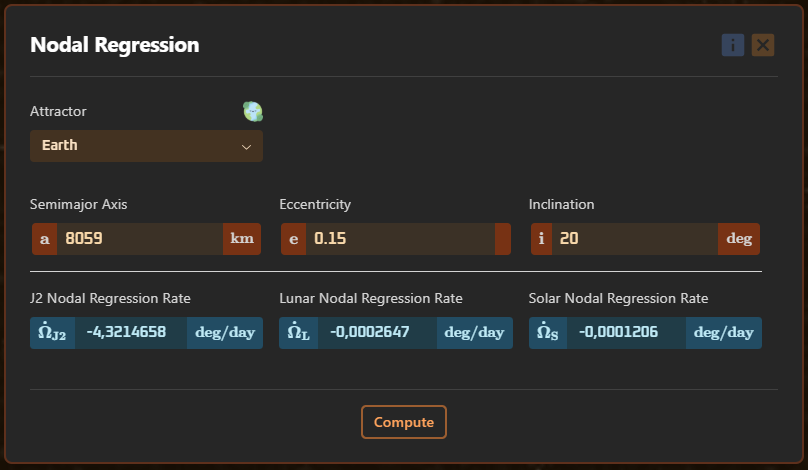

  

    <h3>Apsidal Rotation</h3>
    

      Analyse the secular effect of the Earth's oblateness (J₂) and third-body perturbations (lunar and solar) on the
      argument of periapsis.
    

  

  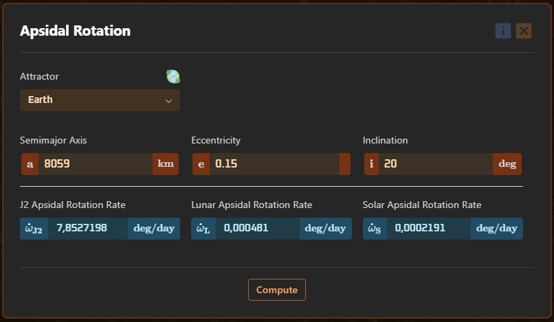

  

    <h3>Sun-Synchronous Orbit</h3>
    

      Compute the inclination conditions for maintaining a sun-synchronous orbit, considering the Earth's oblateness (J₂).
    

  

  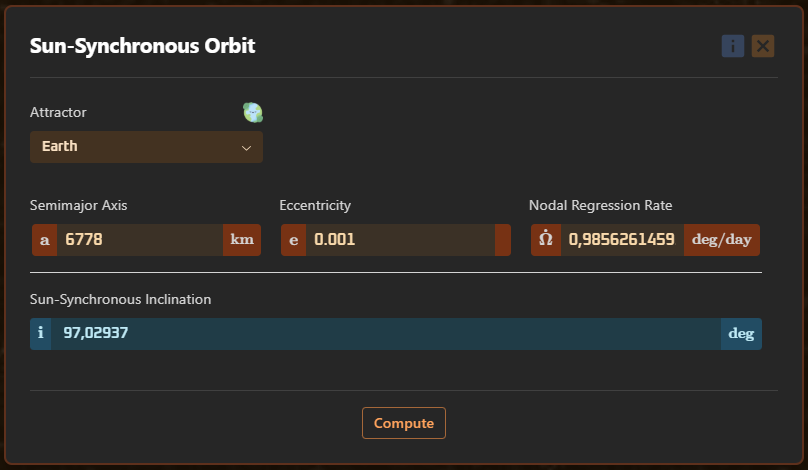

## 🎯 Relative Motion

The `Relative Motion` dialogs furnishes different utilities to convert between Local Vertical Local Horizontal and
Geocentric Equatorial frames.

  

    <h3>LVLH Kinematics</h3>
    

      Given the state vectors of the <strong>target spacecraft</strong> and of the <strong>chaser spacecraft</strong>,
      find the position, velocity, and acceleration of Chaser relative to Target along the
      <strong>Local Vertical Local Horizontal</strong> (LVLH) axes attached to the Target.
    

  

  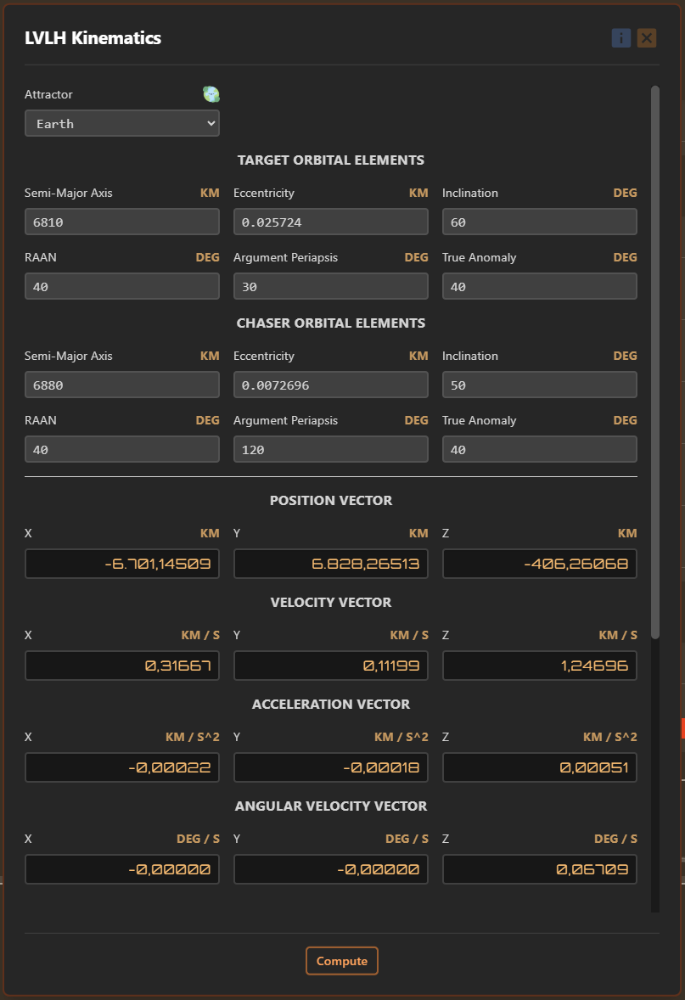

  

    <h3>Geocentric Equatorial Kinematics</h3>
    

      Given the state vectors of the <strong>target spacecraft</strong> and the state vector of the <strong>chaser
      spacecraft</strong> relative to Target along the <strong>Local Vertical Local Horizontal</strong> (LVLH) axes
      attached to the Target, find the position and velocity of Chaser in the Geocentric Equatorial frame.
    

  

  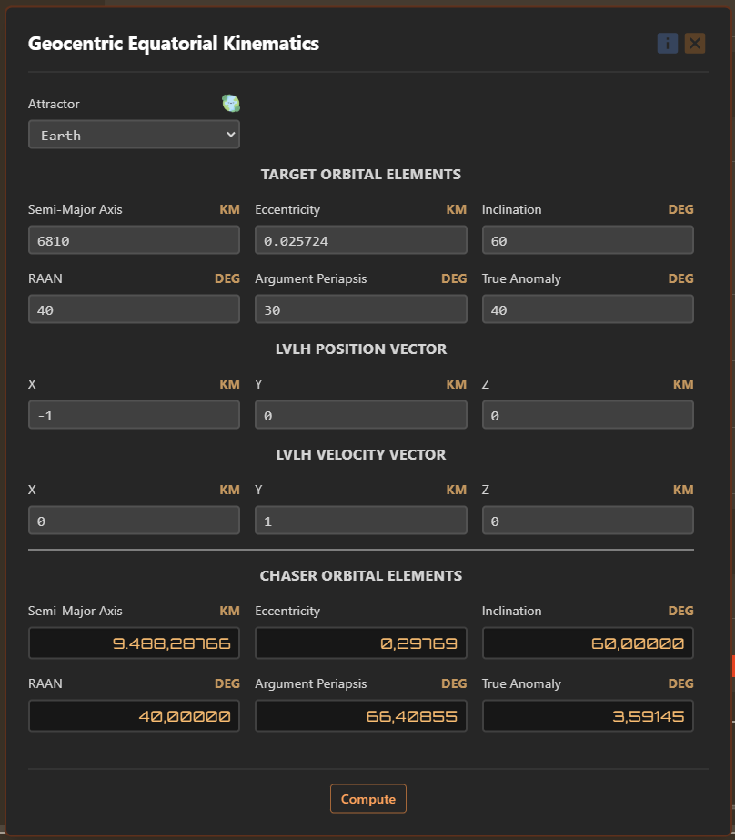

## 🎯 Interplanetary Trajectory

The `Interplanetary Trajectory` dialogs furnishes different utilities used in interplanetary mission design and analysis, under the assumption of circular, coplanar orbits.

  

    <h3>Synodic Period</h3>
    

      The synodic period is the time interval between two successive conjunctions or oppositions of two celestial bodies. It is assumed that the planetary orbits are circular to simplify the calculations.
    

  

  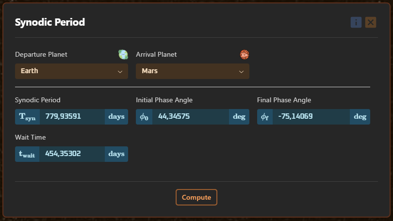

  

    <h3>Sphere Of Influence</h3>
    

      The sphere of influence is the region around a celestial body where its gravitational field dominates over the gravitational field of other bodies.
    

  

  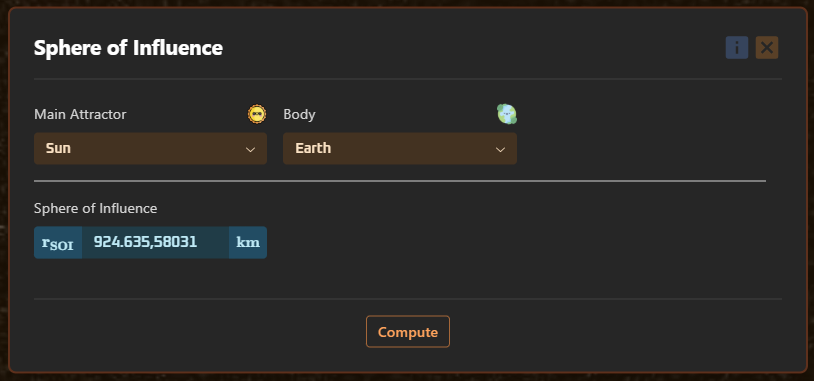

  

    <h3>Transfer</h3>
    

      With the assumption of circular coplanar planetary orbits, the users can compute the departure, rendezvous (with optimal periapse radius), and flyby parameters for interplanetary trajectories.
    

  

  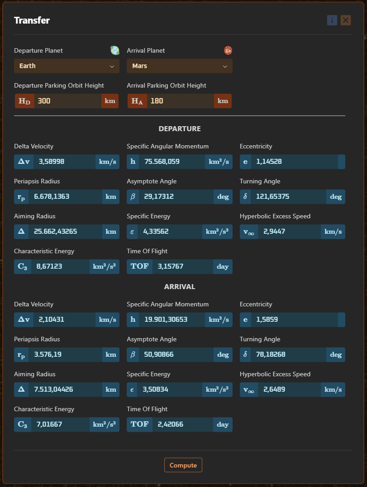

