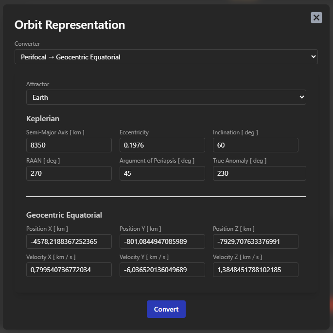

<!-- markdownlint-disable MD033 -->

# 🛠️ Tools

⬅️ [HOME](../../README.md)

Under the menu option **Tools**, the user can take advantage of a series of instruments.

## ♻️ Orbit Representation

The `Orbit Representation` dialog furnishes different utilities to convert orbital data in different formats and representations.

  

  

    <h3>Cartesian → Orbital Parameters</h3>
    

      Given a main <strong>attractor</strong> and the <strong>cartesian parameters</strong> (position and velocity) of an orbit, the converter calculates the <strong>orbit parameters</strong> with conic type classification.
    

  

  

  

    <h3>Cartesian → Keplerian</h3>
    

      Given a main <strong>attractor</strong> and the <strong>cartesian parameters</strong> (position and velocity) of an orbit, the converter calculates the <strong>keplerian parameters</strong> of the orbit.
    

  

  

  

    <h3>Cartesian → Perifocal</h3>
    

      Given a main <strong>attractor</strong> and the <strong>cartesian parameters</strong> (position and velocity) of an orbit, the converter calculates the <strong>perifocal parameters</strong> (position and velocity) of the orbit.
    

  

  

  

    <h3>Perifocal → Geocentric Equatorial</h3>
    

      Given a main <strong>attractor</strong> and the <strong>keplerian parameters</strong> of an orbit, the converter calculates the <strong>geocentric equatorial parameters</strong> (position and velocity) of the orbit.
    

  

  

  

    <h3>Ground Track Propagation</h3>
    

      Given a main <strong>attractor</strong> and the <strong>keplerian parameters</strong> of an orbit, the converter calculates the <strong>right ascension</strong> and <strong>declination</strong> of the satellite on the propagated position, with the oblateness effect of the selected planet.
    

  

